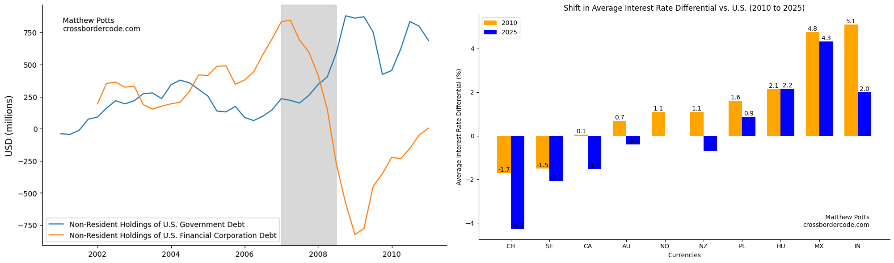

### Research

#### October 2025

- [Using LLMs To Analyse the Effect of U.S. Macroeconomic News: An Application to the Global Financial Cycle](../research/LLMsAndGFCy/LLMsAndGFCy.ipynb)

#### September 2025

- [The Changing Nature of Cross-Border Credit: Through the BIS API and the getBISy Package](../research/BankLendingVsCapitalMarkets/BankLendingVsCapitalMarkets.ipynb)
- [The U.S. Dollar During the GFC - Global Safe Asset?](../research/U.S.Assets.DuringGFC/U.S.Assets.During.Crisis.ipynb)
